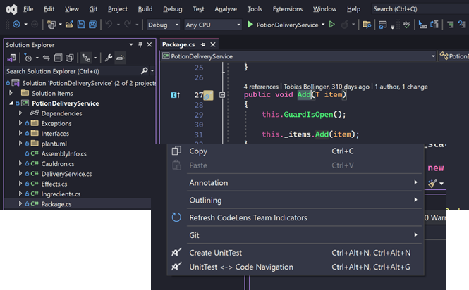

Twizzar automatically creates a unit test for the current member, by either using the Shortcut (<kbd>CTRL</kbd>+<kbd>ALT</kbd>+<kbd>N</kbd>, <kbd>CTRL</kbd>+<kbd>ALT</kbd>+<kbd>N</kbd>) or context menu:

Based on the [mapping](./mapping#mapping) and [template](./templating#templating) a new project, a test class and a new test method for the member you want to test are created. Existing projects and test classes are going to be reused, if they match the [mapping](./mapping#mapping). Nuget packages or usings may be updated during the creation process.
